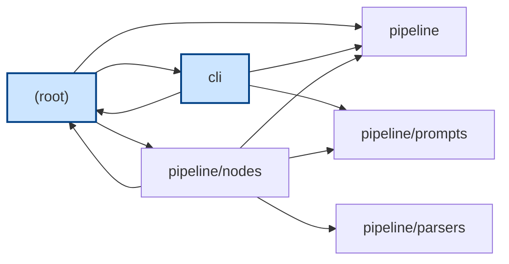
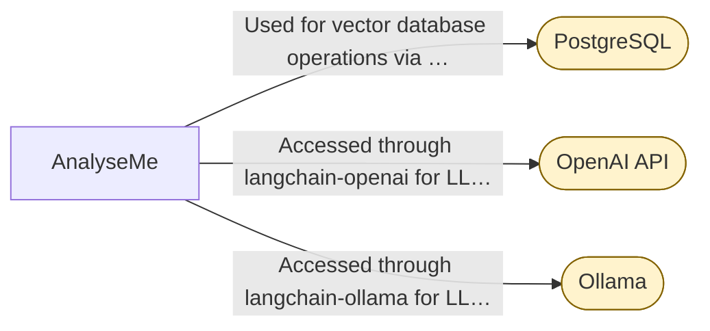
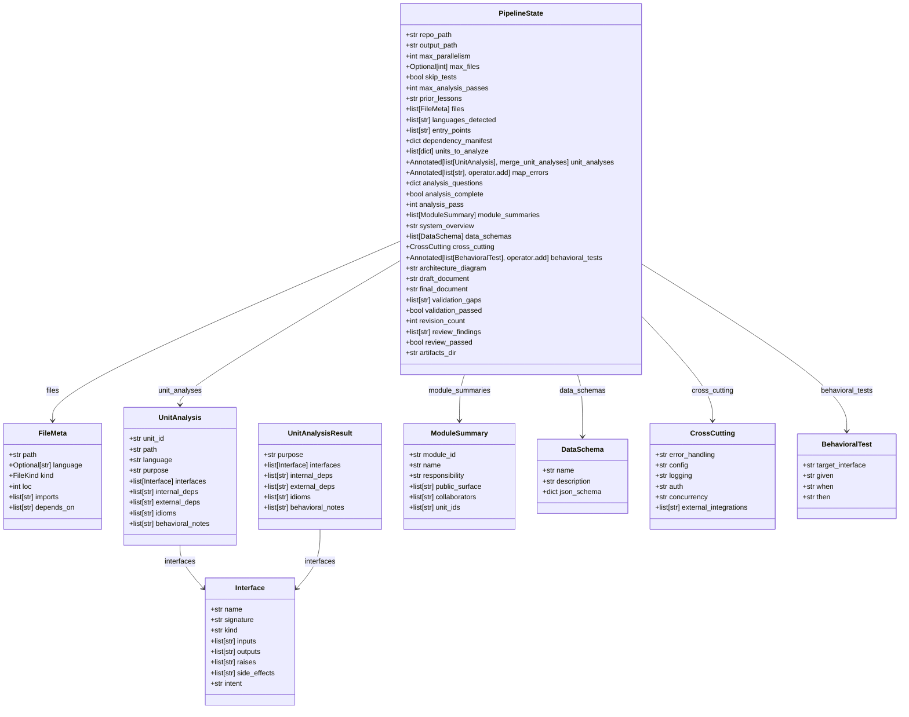

# Reimplementation Specification Document

## 1. Inventory

### File Tree Summary
- Total files: 50
- Languages detected: bash, python

### Languages
- Bash: 1 file (`run.sh`)
- Python: 39 files (e.g., `cli.py`, `main.py`, `pipeline/__init__.py`, etc.)

### Dependencies
- Python dependencies (from `requirements.txt`):
  - `tree-sitter==0.21.3`
  - `tree-sitter-languages==1.10.2`
  - `click>=8.0`
  - `rich>=13.0`
  - `langgraph>=0.2`
  - `langchain-core>=0.3`
  - `langchain-ollama>=0.2`
  - `langchain-openai>=0.2`
  - `langsmith>=0.1`
  - `pydantic>=2.0`
  - `psycopg[binary]>=3.1`
  - `pgvector>=0.2`
  - `requests>=2.28`
  - `questionary>=2.0`

### Entry Points
- `cli.py`
- `main.py`
- `cli/main.py`

## 2. Architecture

### Architecture Diagram

#### Module Dependencies

_Entry-point modules are highlighted. Edges are resolved imports between modules._

#### External Integrations

_External services the system integrates with (rounded nodes)._

#### Data Model

_Data entities from the extracted schemas; arrows show references between them._

### Components
- **CLI Module**: Provides a command-line interface for configuring and managing the analysis pipeline.
- **Pipeline Module**: Manages the code-to-spec analysis pipeline, including initialization, model configuration, and output rendering.
- **Parsers Module**: Extracts and analyzes code structures using tree-sitter.
- **Nodes Module**: Handles tasks such as generating overviews, validating documents, and extracting architecture details.
- **Prompts Module**: Defines prompt templates for the pipeline.

### Data Flow
- Execution begins at entry points, initializing the application and setting up the environment.
- The CLI interacts with users to gather inputs and display results.
- The pipeline processes code repositories, extracting and analyzing code structures.
- Results are rendered and displayed through the CLI.

### Module Boundaries
- Each module has distinct responsibilities, collaborating with others as needed (e.g., `pipeline/nodes` collaborates with `pipeline/parsers`).

## 3. Behavioral Spec

### CLI Module
- **Intent**: Interact with users to configure and manage the pipeline.
- **Interfaces**: Functions for user prompts, interactive chat, and displaying results.
- **Side Effects**: Updates terminal UI, manages pipeline state.
- **Errors**: Handles invalid user inputs.

### Pipeline Module
- **Intent**: Manage the analysis pipeline.
- **Interfaces**: Functions for initializing the pipeline, configuring models, and rendering outputs.
- **Side Effects**: Writes outputs to files, manages cache.
- **Errors**: Handles LLM call failures, repository resolution issues.

### Parsers Module
- **Intent**: Extract and analyze code structures.
- **Interfaces**: Functions for parsing files, extracting imports, and counting lines of code.
- **Side Effects**: None.
- **Errors**: Handles unsupported languages.

### Nodes Module
- **Intent**: Perform various tasks in the pipeline.
- **Interfaces**: Functions for generating overviews, validating documents, and extracting architecture.
- **Side Effects**: Updates pipeline state.
- **Errors**: Handles missing dependencies, incomplete analyses.

### Prompts Module
- **Intent**: Define prompt templates for the pipeline.
- **Interfaces**: None.
- **Side Effects**: None.
- **Errors**: None.

## 4. Contracts

### Data Schemas
- **FileMeta**: Metadata about a file, including path, language, kind, and dependencies.
- **Interface**: Public surface element like a function or class.
- **UnitAnalysis**: Output of a map step for an analyzable unit.
- **ModuleSummary**: Summarizes a module's responsibilities and public surface.
- **CrossCutting**: Captures cross-cutting concerns like error handling and logging.

### API Surfaces
- Defined by public functions and methods in each module.

### Invariants
- Consistent data structures across modules.
- Valid inputs and outputs for each function.

## 5. Cross-Cutting

### Error Handling
- Exceptions for LLM call failures, repository resolution issues, and database operations.

### Config
- Managed through environment variables and Click for CLI parsing.

### Logging
- Implemented in `pipeline/indexer.py` and `pipeline/memory.py`.

### Auth
- Not covered in the analysis.

### Concurrency
- Managed using `threading.BoundedSemaphore`.

### Integrations
- PostgreSQL for vector database operations.
- OpenAI API and Ollama for LLM interactions.

## 6. Reimplementation Notes

- Use idiomatic Python for handling exceptions and managing concurrency.
- Ensure environment variables are correctly set for configuration.

## 7. Acceptance Tests

- **Pipeline Reflection**: Given a repository name, when reflecting on a run, then capture programming languages and unit count.
- **System Synthesis**: Given a `PipelineState` object, when synthesizing the system, then generate module summaries.
- **Validation**: Given a `PipelineState` object, when validating, then ensure analyses and draft documents are complete.
- **RAG Index Initialization**: When initializing, then create an instance of `RAGIndex`.
- **Cache Management**: Given a cache key, when retrieving, then return the cached value if present.
- **Unit Analysis**: Given a valid state dictionary, when analyzing a unit, then perform the analysis correctly.

## Interface Reference

_Complete per-interface documentation extracted from the source (ground truth)._

### `cli.py`
- **main** (function) — `main(repo: str, out: str, provider: str, model: str | None, ollama_url: str, max_parallelism: int, max_files: int | None, skip_tests: bool, analysis_passes: int, thread_id: str | None, langsmith_project: str | None, no_cache: bool, clear_cache: bool)`
  - Intent: Ingest a codebase and produce a language-agnostic reimplementation spec, handling caching, tracing, and repository resolution.
  - Inputs: repo: str — Local path OR git URL to analyze, out: str — Output file path, provider: str — LLM provider, model: str | None — Model id, ollama_url: str — Ollama base URL, max_parallelism: int — Max parallel analyze_unit calls, max_files: int | None — Cap number of source files analyzed, skip_tests: bool — Skip test files, analysis_passes: int — Completeness-refinement passes, thread_id: str | None — Resume a previous run by thread ID, langsmith_project: str | None — LangSmith project name for tracing, no_cache: bool — Disable the on-disk LLM response cache, clear_cache: bool — Delete all cached LLM responses before running
  - Raises: SystemExit: when API key environment variable is not set, SystemExit: when repository cannot be resolved
  - Side effects: Sets environment variables for LLM provider and model, Clears LLM cache if specified, Prints status and progress messages, Writes the generated specification to a file

### `cli/chat.py`
- **_format_context** (function) — `_format_context(docs) -> str`
  - Intent: Format document contents with metadata labels for display.
  - Inputs: docs: iterable — collection of document objects with metadata
  - Outputs: str — formatted string of document contents with labels
- **_sources_line** (function) — `_sources_line(docs) -> str`
  - Intent: Generate a unique list of document tags from metadata for citation.
  - Inputs: docs: iterable — collection of document objects with metadata
  - Outputs: str — comma-separated list of unique document tags
- **chat_repl** (function) — `chat_repl(collection: str, k: int = 8) -> None`
  - Intent: Run an interactive Q&A loop querying an indexed collection with a local LLM.
  - Inputs: collection: str — name of the indexed collection to query, k: int — number of similar documents to retrieve
  - Outputs: None
  - Side effects: prints to console, interacts with a vector database, calls a local LLM

### `cli/main.py`
- **PipelineBuffer** (class) — `PipelineBuffer(max_messages: int = 100)`
  - Intent: Encapsulates the mutable state shared between the stream loop and the display renderer.
  - Inputs: max_messages: int — maximum number of messages to retain in the buffer
- **__init__** (method) — `__init__(self, max_messages: int = 100)`
  - Intent: Initialize the PipelineBuffer with default values and structures for tracking pipeline execution.
  - Inputs: max_messages: int — maximum number of messages to retain
  - Side effects: Initializes the message buffer and node status tracking.
- **add_message** (method) — `add_message(self, msg_type: str, content: str) -> None`
  - Intent: Add a new message to the buffer with a timestamp.
  - Inputs: msg_type: str — type of the message, content: str — content of the message
  - Side effects: Appends a timestamped message to the message buffer.
- **set_node** (method) — `set_node(self, node_id: str, status: str) -> None`
  - Intent: Update the status of a specific node in the pipeline.
  - Inputs: node_id: str — identifier of the node, status: str — new status of the node
  - Side effects: Updates the status of a node and sets it as the current node if in progress.
- **complete_node** (method) — `complete_node(self, node_id: str) -> None`
  - Intent: Mark a node as completed by updating its status.
  - Inputs: node_id: str — identifier of the node
  - Side effects: Marks a node as completed.

### `cli/main.py`
- **_default** (function) — `_default(ctx: typer.Context) -> None`
  - Intent: Invoke the startup menu if no subcommand is provided.
  - Inputs: ctx: typer.Context — the context of the Typer application
- **create_layout** (function) — `create_layout() -> Layout`
  - Intent: Set up the layout structure for the terminal UI.
  - Outputs: Layout — the configured layout for the terminal UI
- **update_display** (function) — `update_display(layout: Layout) -> None`
  - Intent: Refresh the terminal UI with the latest pipeline progress and messages.
  - Inputs: layout: Layout — the layout to update with current information
- **get_user_selections** (function) — `get_user_selections() -> dict`
  - Intent: Collect user input for pipeline configuration through an interactive wizard.
  - Outputs: dict — user selections for pipeline configuration
- **step_box** (function) — `step_box(title: str, hint: str) -> None`
  - Intent: Display a step box with a title and hint in the terminal UI.
  - Inputs: title: str — the title of the step, hint: str — a hint or description for the step
- **_safe_name** (function) — `_safe_name(path: str) -> str`
  - Intent: Convert a unit path into a filename-safe string.
  - Inputs: path: str — the unit path to convert
  - Outputs: str — a safe filename derived from the path
- **_persist_class_spec** (function) — `_persist_class_spec(ua) -> None`
  - Intent: Store the per-class specification in the buffer and on disk.
  - Inputs: ua — the unit analysis object
- **_persist_stage_doc** (function) — `_persist_stage_doc(node_id: str, update: dict) -> None`
  - Intent: Store the per-stage documentation in the buffer and on disk.
  - Inputs: node_id: str — the identifier of the pipeline stage, update: dict — the update data for the stage
- **_pause** (function) — `_pause(message: str = 'Press Enter to return to the menu…') -> None`
  - Intent: Pause execution and wait for user input to continue.
  - Inputs: message: str — the message to display during the pause
- **_render_doc** (function) — `_render_doc(title: str, content: str) -> None`
  - Intent: Render a markdown document in the terminal UI.
  - Inputs: title: str — the title of the document, content: str — the content of the document
- **interactive_viewer** (function) — `interactive_viewer(final_doc: str) -> None`
  - Intent: Allow users to browse through various documents and reports post-pipeline execution.
  - Inputs: final_doc: str — the final document to display
- **run_pipeline** (function) — `run_pipeline(no_cache: bool = False, clear_cache: bool = False) -> None`
  - Intent: Execute the pipeline with the given configuration and cache settings.
  - Inputs: no_cache: bool — whether to disable caching, clear_cache: bool — whether to clear the cache

### `cli/utils.py`
- **ask_repo_path** (function) — `ask_repo_path() -> str`
  - Intent: Prompt the user for a repository path or URL and validate the input.
  - Outputs: str — the validated repository path or URL
  - Side effects: Exits the program if no repository is provided
- **_valid** (function) — `_valid(val: str) -> bool | str`
  - Intent: Validate whether the input is a valid directory path or git URL.
  - Inputs: val: str — the input value to validate
  - Outputs: bool | str — True if valid, error message if not
- **ask_output_file** (function) — `ask_output_file() -> str`
  - Intent: Prompt the user for the name of the output file, defaulting to 'spec.md'.
  - Outputs: str — the name of the output file
- **ask_provider** (function) — `ask_provider() -> str`
  - Intent: Prompt the user to select an LLM provider from a list of available options.
  - Outputs: str — the selected LLM provider
- **ask_model** (function) — `ask_model(provider: str) -> str`
  - Intent: Prompt the user to select a model for the given provider, with options for custom input.
  - Inputs: provider: str — the selected LLM provider
  - Outputs: str — the selected model for the provider
  - Side effects: Warns if the provider's API key is missing
- **ask_ollama_model** (function) — `ask_ollama_model() -> str`
  - Intent: Fetch and prompt the user to select an Ollama model, with an option for custom input.
  - Outputs: str — the selected Ollama model
- **ask_max_files** (function) — `ask_max_files() -> int | None`
  - Intent: Prompt the user to set a file cap for limiting LLM calls on large repositories.
  - Outputs: int | None — the file cap or None for no cap
- **ask_skip_tests** (function) — `ask_skip_tests() -> bool`
  - Intent: Prompt the user to decide whether to skip test files during analysis.
  - Outputs: bool — whether to skip test files
- **ask_analysis_passes** (function) — `ask_analysis_passes() -> int`
  - Intent: Prompt the user to specify the number of analysis refinement passes.
  - Outputs: int — the number of analysis refinement passes

### `graph.py`
- **route_to_units** (function) — `route_to_units(state: PipelineState) -> list[Send]`
  - Intent: Generate a list of Send objects for each unit descriptor to be analyzed.
  - Inputs: state: PipelineState — the current state of the pipeline
  - Outputs: list[Send] — a list of Send objects for each unit descriptor
- **should_refine_analysis** (function) — `should_refine_analysis(state: PipelineState)`
  - Intent: Determine whether to re-analyze flagged units or proceed to module reduction.
  - Inputs: state: PipelineState — the current state of the pipeline
  - Outputs: list[Send] or str — Send objects for re-analysis or 'reduce_modules' to proceed
- **should_revise** (function) — `should_revise(state: PipelineState) -> str`
  - Intent: Decide whether to loop back for revisions or end the process based on validation and review results.
  - Inputs: state: PipelineState — the current state of the pipeline
  - Outputs: str — 'assemble_document' to loop back or END to finish
- **build_graph** (function) — `build_graph(checkpointer=None)`
  - Intent: Construct and compile the state graph for the code-to-spec pipeline.
  - Inputs: checkpointer: optional — a checkpointing mechanism
  - Outputs: StateGraph — the compiled state graph for the pipeline

### `pipeline/artifacts.py`
- **render_class_spec** (function) — `render_class_spec(ua) -> str`
  - Intent: Generate a Markdown document detailing the specifications of a unit analysis.
  - Inputs: ua: UnitAnalysis — the unit analysis object to render
  - Outputs: str — Markdown representation of the unit analysis
- **render_stage_doc** (function) — `render_stage_doc(node_id: str, update: dict) -> str | None`
  - Intent: Create a Markdown document summarizing the results of a pipeline stage based on its state update.
  - Inputs: node_id: str — identifier for the pipeline stage, update: dict — state update information for the stage
  - Outputs: str | None — Markdown document for the stage or None if not applicable
- **write_text** (function) — `write_text(path: Path, content: str) -> None`
  - Intent: Helper function to write text content to a file.
  - Inputs: path: Path — the file path to write to, content: str — the text content to write
  - Outputs: None
  - Side effects: Writes content to a file at the specified path

### `pipeline/cache.py`
- **enabled** (function) — `enabled() -> bool`
  - Intent: Check if the cache is enabled based on environment variables.
  - Outputs: bool — whether the cache is enabled
- **cache_dir** (function) — `cache_dir() -> Path`
  - Intent: Determine and ensure the existence of the cache directory.
  - Outputs: Path — the directory path for the cache
  - Side effects: Creates the cache directory if it does not exist
- **make_key** (function) — `make_key(*parts: str) -> str`
  - Intent: Generate a stable cache key from given parts.
  - Inputs: parts: str — components to hash into a key
  - Outputs: str — a SHA-256 hash of the input parts
- **get** (function) — `get(key: str)`
  - Intent: Retrieve a cached value by its key, if available.
  - Inputs: key: str — the cache key to retrieve
  - Outputs: The cached value or None if not found
  - Side effects: Reads from the cache file system
- **set** (function) — `set(key: str, value) -> None`
  - Intent: Store a value in the cache under a specific key.
  - Inputs: key: str — the cache key to store under, value — the JSON-serializable value to cache
  - Side effects: Writes to the cache file system
- **clear** (function) — `clear() -> int`
  - Intent: Remove all entries from the cache.
  - Outputs: int — the number of cache files removed
  - Side effects: Deletes cache files from the file system

### `pipeline/indexer.py`
- **_chunk** (function) — `_chunk(text: str, size: int = 1400, overlap: int = 150) -> list[str]`
  - Intent: Split a given text into chunks of a specified size with overlap to facilitate processing without external dependencies.
  - Inputs: text: str — the text to be chunked, size: int — the maximum size of each chunk, overlap: int — the number of overlapping characters between chunks
  - Outputs: list[str] — list of text chunks
- **_split_spec_sections** (function) — `_split_spec_sections(spec: str) -> list[tuple[str, str]]`
  - Intent: Divide a specification document into sections based on top-level headings for structured processing.
  - Inputs: spec: str — the specification text to be split
  - Outputs: list[tuple[str, str]] — list of tuples containing section titles and bodies
- **index_run** (function) — `index_run(repo_path: str, class_docs: dict[str, str], spec_text: str, log=print) -> tuple[str, int]`
  - Intent: Embed and store code and specifications from a repository into a vector database for later retrieval.
  - Inputs: repo_path: str — the path to the repository, class_docs: dict[str, str] — dictionary of class documentation, spec_text: str — the specification text, log: callable — logging function, defaults to print
  - Outputs: tuple[str, int] — the collection name and document count
  - Side effects: Reads files from the filesystem, Logs messages, Interacts with a vector database

### `pipeline/llm.py`
- **get_provider** (function) — `get_provider() -> str`
  - Intent: Retrieve the active LLM provider key from environment variables.
  - Outputs: str — the active LLM provider key
- **get_model_id** (function) — `get_model_id() -> str`
  - Intent: Resolve the chat model id using environment variables or provider defaults.
  - Outputs: str — the resolved chat model id
- **get_llm** (function) — `get_llm(temperature: float = 0)`
  - Intent: Instantiate and return an LLM client based on the provider configuration.
  - Inputs: temperature: float — the desired temperature setting for the LLM
- **_invoke_with_retry** (function) — `_invoke_with_retry(llm, messages, max_conn_retries: int = 5)`
  - Intent: Invoke the LLM with retry logic for transient connection errors.
  - Inputs: llm: the LLM client to invoke, messages: the messages to send to the LLM, max_conn_retries: int — maximum number of connection retries
  - Raises: RuntimeError: when the LLM provider is unreachable after retries
  - Side effects: Retries LLM invocation on transient connection errors
- **_extract_json_from_text** (function) — `_extract_json_from_text(text: str) -> str`
  - Intent: Extract raw JSON text from a string, removing markdown code fences.
  - Inputs: text: str — the text containing JSON
  - Outputs: str — the extracted raw JSON text
- **_try_repair_json** (function) — `_try_repair_json(text: str) -> str`
  - Intent: Attempt to repair truncated JSON by closing open brackets and braces.
  - Inputs: text: str — the potentially truncated JSON text
  - Outputs: str — the repaired JSON text
- **call_llm_json** (function) — `call_llm_json(prompt: str, max_retries: int = 2) -> dict | list`
  - Intent: Call the LLM and parse a JSON object or array from the response, with caching.
  - Inputs: prompt: str — the prompt to send to the LLM, max_retries: int — maximum number of retries for JSON parsing
  - Outputs: dict | list — the parsed JSON object or array
  - Raises: ValueError: when valid JSON cannot be obtained after retries
  - Side effects: Caches the result of the LLM call
- **_call_llm_json_uncached** (function) — `_call_llm_json_uncached(prompt: str, max_retries: int = 2) -> dict | list`
  - Intent: Call the LLM and parse a JSON object or array from the response without caching.
  - Inputs: prompt: str — the prompt to send to the LLM, max_retries: int — maximum number of retries for JSON parsing
  - Outputs: dict | list — the parsed JSON object or array
  - Raises: ValueError: when valid JSON cannot be obtained after retries
- **call_llm_structured** (function) — `call_llm_structured(prompt: str, schema, max_retries: int = 2)`
  - Intent: Call the LLM and return a validated instance of a schema, using structured output.
  - Inputs: prompt: str — the prompt to send to the LLM, schema: the pydantic model schema for validation, max_retries: int — maximum number of retries
  - Side effects: Caches the validated instance of the schema
- **_call_llm_structured_uncached** (function) — `_call_llm_structured_uncached(prompt: str, schema, max_retries: int = 2)`
  - Intent: Call the LLM and return a validated instance of a schema without caching.
  - Inputs: prompt: str — the prompt to send to the LLM, schema: the pydantic model schema for validation, max_retries: int — maximum number of retries
- **call_llm_text** (function) — `call_llm_text(prompt: str) -> str`
  - Intent: Call the LLM and return the raw text response, with caching.
  - Inputs: prompt: str — the prompt to send to the LLM
  - Outputs: str — the raw text response from the LLM
  - Side effects: Caches the raw text response

### `pipeline/memory.py`
- **__init__** (method) — `__init__(self, path: str | os.PathLike | None = None, max_entries: int | None = 50)`
  - Intent: Initialize the RunMemory object with a path for storing logs and a limit on the number of entries.
  - Inputs: path: str | os.PathLike | None — the file path for storing memory logs, max_entries: int | None — maximum number of entries to retain
  - Side effects: Initializes the RunMemory instance with a specified path and entry limit
- **store_run** (method) — `store_run(self, repo_path: str, model: str, languages: list[str], unit_count: int, hallucinations: list[str], reflection: str = "") -> None`
  - Intent: Append a new run entry to the memory log, capturing details of the run and any hallucinations caught.
  - Inputs: repo_path: str — path to the repository, model: str — model used for the run, languages: list[str] — languages involved in the run, unit_count: int — number of units processed, hallucinations: list[str] — hallucinations caught during the run, reflection: str — optional reflection notes
  - Raises: OSError: when file operations fail
  - Side effects: Writes a new entry to the memory log file
- **_load_blocks** (method) — `_load_blocks(self) -> list[str]`
  - Intent: Load and return all log entries from the memory file, splitting them by the defined separator.
  - Outputs: list[str] — list of log entries
- **get_past_context** (method) — `get_past_context(self, repo_path: str, n: int = 3) -> str`
  - Intent: Retrieve and format past hallucination lessons for a given repository to prevent their recurrence in future runs.
  - Inputs: repo_path: str — path to the repository, n: int — number of past entries to retrieve
  - Outputs: str — formatted string of past lessons
- **_rotate** (method) — `_rotate(self, blocks: list[str]) -> list[str]`
  - Intent: Ensure the number of log entries does not exceed the maximum allowed, removing the oldest entries if necessary.
  - Inputs: blocks: list[str] — list of log entries
  - Outputs: list[str] — rotated list of log entries

### `pipeline/model_catalog.py`
- **list_providers** (function) — `list_providers() -> list[tuple[str, str]]`
  - Intent: Retrieve a list of available model providers and their display labels.
  - Outputs: list[tuple[str, str]] — list of provider keys and their labels
- **provider_config** (function) — `provider_config(provider: str) -> dict`
  - Intent: Fetch the configuration for a specified provider, defaulting to 'ollama' if not found.
  - Inputs: provider: str — the key of the provider to retrieve configuration for
  - Outputs: dict — configuration details of the specified provider
- **get_model_options** (function) — `get_model_options(provider: str) -> list[tuple[str, str]]`
  - Intent: Retrieve available model options for a given provider.
  - Inputs: provider: str — the key of the provider to retrieve model options for
  - Outputs: list[tuple[str, str]] — list of model options for the specified provider
- **default_model** (function) — `default_model(provider: str) -> str`
  - Intent: Get the default model identifier for a specified provider.
  - Inputs: provider: str — the key of the provider to retrieve the default model for
  - Outputs: str — default model identifier for the specified provider

### `pipeline/nodes/analyze_unit.py`
- **_get_semaphore** (function) — `_get_semaphore(size: int) -> threading.BoundedSemaphore`
  - Intent: Create or retrieve a semaphore to control concurrency based on the specified size.
  - Inputs: size: int — the desired size of the semaphore
  - Outputs: threading.BoundedSemaphore — a semaphore object with the specified size
  - Side effects: modifies _SEM_STATE to store the semaphore and its size
- **_elide** (function) — `_elide(source_bytes: bytes, ranges: list) -> str`
  - Intent: Replace specified byte ranges in the source with a marker to indicate elided content.
  - Inputs: source_bytes: bytes — the source file content, ranges: list — byte ranges to be replaced
  - Outputs: str — the modified source with specified ranges elided
- **_select_source** (function) — `_select_source(state: dict) -> tuple[str, str]`
  - Intent: Select and return the relevant source snippet and focus note based on the unit kind.
  - Inputs: state: dict — the unit descriptor containing path and kind information
  - Outputs: tuple[str, str] — a snippet of the source and a focus note
- **analyze_unit** (function) — `analyze_unit(state: dict) -> dict`
  - Intent: Perform structure extraction and semantic analysis on a code unit, returning the analysis results.
  - Inputs: state: dict — the unit descriptor with analysis parameters
  - Outputs: dict — containing unit analyses and any mapping errors

### `pipeline/nodes/assemble_document.py`
- **_build_inventory** (function) — `_build_inventory(state: PipelineState) -> str`
  - Intent: Generate a summary of the project's source files, languages, entry points, and dependencies.
  - Inputs: state: PipelineState — the current pipeline state containing analysis data
  - Outputs: str — a formatted inventory of files, languages, entry points, and dependencies
- **_build_interface_reference** (function) — `_build_interface_reference(state: PipelineState) -> str`
  - Intent: Create a comprehensive documentation of all public interfaces based on the analysis data.
  - Inputs: state: PipelineState — the current pipeline state containing analysis data
  - Outputs: str — a formatted reference of public interfaces
- **_insert_diagram** (function) — `_insert_diagram(doc: str, diagram: str) -> str`
  - Intent: Insert a Mermaid diagram into the document at a specific location.
  - Inputs: doc: str — the document to insert the diagram into, diagram: str — the diagram to be inserted
  - Outputs: str — the document with the diagram inserted
- **assemble_document** (function) — `assemble_document(state: PipelineState) -> dict`
  - Intent: Compile the final document by integrating inventory, interface references, and diagrams.
  - Inputs: state: PipelineState — the current pipeline state containing analysis data
  - Outputs: dict — the assembled document with all relevant sections

### `pipeline/nodes/extract_architecture.py`
- **_aggregate_evidence** (function) — `_aggregate_evidence(unit_analyses, dep_manifest) -> dict`
  - Intent: Aggregate cross-cutting evidence from unit analyses and dependency manifests.
  - Inputs: unit_analyses: list — analyses of individual units, dep_manifest: dict — manifest of dependencies
  - Outputs: dict — aggregated evidence of cross-cutting concerns
- **_deterministic_schemas** (function) — `_deterministic_schemas(state: PipelineState) -> list[DataSchema]`
  - Intent: Build data schemas from actual class fields using tree-sitter.
  - Inputs: state: PipelineState — the current pipeline state
  - Outputs: list[DataSchema] — list of data schemas derived from class fields
- **extract_architecture** (function) — `extract_architecture(state: PipelineState) -> dict`
  - Intent: Extract architecture details including data schemas and cross-cutting concerns from the pipeline state.
  - Inputs: state: PipelineState — the current pipeline state
  - Outputs: dict — extracted architecture details including data schemas and cross-cutting concerns
- **_summary** (function) — `_summary(items: list[str], n: int = 5) -> str`
  - Intent: Create a summary string from a list of items, limiting the number of items.
  - Inputs: items: list[str] — list of items to summarize, n: int — maximum number of items to include in the summary
  - Outputs: str — summarized string of items

### `pipeline/nodes/generate_diagram.py`
- **_node_id** (function) — `_node_id(name: str) -> str`
  - Intent: Create a stable identifier for a node in a Mermaid diagram.
  - Inputs: name: str — the name to convert into a node id
  - Outputs: str — a stable, Mermaid-safe node id
- **_module_label** (function) — `_module_label(name: str) -> str`
  - Intent: Generate a label for a module, using '(root)' for the root module.
  - Inputs: name: str — the module name
  - Outputs: str — the label for the module
- **_clean_label** (function) — `_clean_label(text: str, limit: int = 40) -> str`
  - Intent: Clean and truncate text for use as a Mermaid label.
  - Inputs: text: str — the text to clean, limit: int — maximum length of the label
  - Outputs: str — cleaned and truncated label
- **_module_graph** (function) — `_module_graph(modules, entry_points) -> str | None`
  - Intent: Generate a Mermaid graph of module dependencies.
  - Inputs: modules: list — list of module objects, entry_points: list — list of entry point paths
  - Outputs: str | None — Mermaid graph representation or None if no modules
- **_lib_key** (function) — `_lib_key(name: str) -> str`
  - Intent: Normalize a name for library matching.
  - Inputs: name: str — the name to normalize
  - Outputs: str — normalized library key
- **_integrations_graph** (function) — `_integrations_graph(cross_cutting, system_label: str, exclude: set[str]) -> str | None`
  - Intent: Generate a Mermaid graph of external integrations.
  - Inputs: cross_cutting: object — contains external integrations, system_label: str — label for the system, exclude: set[str] — set of names to exclude
  - Outputs: str | None — Mermaid graph of integrations or None if no integrations
- **_member_name** (function) — `_member_name(name: str) -> str`
  - Intent: Sanitize a member name for use in diagrams.
  - Inputs: name: str — the member name to sanitize
  - Outputs: str — sanitized member name
- **_field_type** (function) — `_field_type(prop) -> str`
  - Intent: Determine the human-readable type for a JSON-schema property.
  - Inputs: prop: dict — JSON-schema property
  - Outputs: str — human-readable type
- **_refs** (function) — `_refs(prop) -> set[str]`
  - Intent: Identify schema names referenced by a property.
  - Inputs: prop: dict — JSON-schema property
  - Outputs: set[str] — referenced schema names
- **_data_model** (function) — `_data_model(data_schemas) -> str | None`
  - Intent: Generate a Mermaid class diagram from data schemas.
  - Inputs: data_schemas: list — list of data schema objects
  - Outputs: str | None — Mermaid class diagram or None if no schemas
- **generate_diagram** (function) — `generate_diagram()`
  - Intent: Main function to generate architecture diagrams.

### `pipeline/nodes/generate_tests.py`
- **generate_tests** (function) — `generate_tests(state: PipelineState) -> dict`
  - Intent: Generate behavioral tests for each public interface based on unit analyses, ensuring coverage for all interfaces.
  - Inputs: state: PipelineState — the current state of the pipeline containing unit analyses
  - Outputs: dict — a dictionary containing generated behavioral tests

### `pipeline/nodes/ingest.py`
- **is_third_party** (function) — `is_third_party(dep: str) -> bool`
  - Intent: Determine if a given dependency is a third-party package, not part of the standard library or a relative import.
  - Inputs: dep: str — the dependency name to check
  - Outputs: bool — True if the dependency is third-party
- **_resolve_dependencies** (function) — `_resolve_dependencies(files: list[FileMeta]) -> None`
  - Intent: Resolve raw imports to internal dependencies within the repository.
  - Inputs: files: list[FileMeta] — list of file metadata objects
  - Outputs: None
  - Side effects: Modifies FileMeta.depends_on for each file
- **_exists** (function) — `_exists(base: str, exts: tuple[str, ...]) -> str | None`
  - Intent: Check if a file with any of the given extensions exists in the repository.
  - Inputs: base: str — base path to check, exts: tuple[str, ...] — possible file extensions
  - Outputs: str | None — resolved path if exists, else None
- **_resolve_one** (function) — `_resolve_one(imp: str, language: str, file_dir: str) -> str | None`
  - Intent: Resolve a single import statement to a file path within the repository.
  - Inputs: imp: str — import statement, language: str — programming language of the file, file_dir: str — directory of the file
  - Outputs: str | None — resolved path if exists, else None
- **_classify_kind** (function) — `_classify_kind(rel_path: str, ext: str) -> FileKind`
  - Intent: Classify a file based on its path and extension into categories like TEST, DOC, BUILD, CONFIG, SOURCE, or OTHER.
  - Inputs: rel_path: str — relative path of the file, ext: str — file extension
  - Outputs: FileKind — classification of the file kind
- **_extract_imports** (function) — `_extract_imports(source: str, language: str) -> list[str]`
  - Intent: Extract import statements from the source code of a file.
  - Inputs: source: str — source code of the file, language: str — programming language of the file
  - Outputs: list[str] — list of extracted import statements
- **_parse_requirements_txt** (function) — `_parse_requirements_txt(path: str) -> dict`
  - Intent: Parse a requirements.txt file to extract Python dependencies.
  - Inputs: path: str — path to the requirements.txt file
  - Outputs: dict — dictionary containing type and dependencies
- **_parse_package_json** (function) — `_parse_package_json(path: str) -> dict`
  - Intent: Parse a package.json file to extract JavaScript/Node.js dependencies.
  - Inputs: path: str — path to the package.json file
  - Outputs: dict — dictionary containing package information
- **_parse_go_mod** (function) — `_parse_go_mod(path: str) -> dict`
  - Intent: Parse a go.mod file to extract Go module dependencies.
  - Inputs: path: str — path to the go.mod file
  - Outputs: dict — dictionary containing module information
- **_parse_cargo_toml** (function) — `_parse_cargo_toml(path: str) -> dict`
  - Intent: Parse a Cargo.toml file to extract Rust package dependencies.
  - Inputs: path: str — path to the Cargo.toml file
  - Outputs: dict — dictionary containing package information
- **_parse_pom_xml** (function) — `_parse_pom_xml(path: str) -> dict`
  - Intent: Parse a pom.xml file to extract Maven project dependencies.
  - Inputs: path: str — path to the pom.xml file
  - Outputs: dict — dictionary containing project information
- **ingest** (function) — `ingest() -> None`
  - Intent: Walk through the repository to classify files, parse dependency manifests, and detect entry points.
  - Outputs: None

### `pipeline/nodes/reduce_modules.py`
- **reduce_modules** (function) — `reduce_modules(state: PipelineState) -> dict`
  - Intent: Groups unit analyses by directory and synthesizes a ModuleSummary for each group.
  - Inputs: state: PipelineState — the pipeline state containing unit analyses
  - Outputs: dict — a dictionary containing module summaries

### `pipeline/nodes/review_completeness.py`
- **review_completeness** (function) — `review_completeness(state: PipelineState) -> dict`
  - Intent: Identify missing interfaces and empty intents in unit analyses, and generate questions for further analysis.
  - Inputs: state: PipelineState — the current state of the pipeline including unit analyses and repo path
  - Outputs: dict — containing analysis questions, completeness status, and pass number

### `pipeline/nodes/review_consistency.py`
- **_build_ground_truth** (function) — `_build_ground_truth(state: PipelineState) -> str`
  - Intent: Assemble a comprehensive set of verifiable facts to ensure the document's consistency with the ground truth.
  - Inputs: state: PipelineState — the current state of the pipeline containing analyses and dependencies
  - Outputs: str — JSON string of verifiable facts
- **_dep_name** (function) — `_dep_name(s: str) -> str`
  - Intent: Extract the base package name from a dependency string, removing version specifiers and extras.
  - Inputs: s: str — the dependency string with potential version specifiers
  - Outputs: str — the stripped package name
- **_norm** (function) — `_norm(t: str) -> str`
  - Intent: Normalize a string by stripping punctuation and converting it to lowercase.
  - Inputs: t: str — the text to normalize
  - Outputs: str — normalized text
- **_is_symbol_like** (function) — `_is_symbol_like(t: str) -> bool`
  - Intent: Determine if a token resembles a code symbol based on its format.
  - Inputs: t: str — the token to check
  - Outputs: bool — whether the token resembles a code symbol
- **_collect_known_symbols** (function) — `_collect_known_symbols(state: PipelineState) -> set[str]`
  - Intent: Collect all known symbols from the pipeline state that the document may reference.
  - Inputs: state: PipelineState — the current state of the pipeline
  - Outputs: set[str] — set of known symbols
- **_entity_grounded** (function) — `_entity_grounded(entity: str, known: set[str], known_deps: set[str]) -> bool`
  - Intent: Check if a claimed-fake entity is actually real based on known symbols and dependencies.
  - Inputs: entity: str — the entity to check, known: set[str] — known symbols, known_deps: set[str] — known dependencies
  - Outputs: bool — whether the entity is grounded in known symbols or dependencies
- **_filter_findings** (function) — `_filter_findings(findings: list[str], state: PipelineState) -> list[str]`
  - Intent: Filter out findings that are contradicted by the ground truth to prevent false positives.
  - Inputs: findings: list[str] — list of findings to filter, state: PipelineState — the current state of the pipeline
  - Outputs: list[str] — filtered list of findings
- **_strip_deterministic** (function) — `_strip_deterministic()`
  - Intent: The code does not provide enough information to determine the purpose, inputs, outputs, or side effects of this function.
- **review_consistency** (function) — `review_consistency()`
  - Intent: The code does not provide enough information to determine the purpose, inputs, outputs, or side effects of this function.

### `pipeline/nodes/route_units.py`
- **_file_units** (function) — `_file_units(file_meta, repo_path: str, max_parallelism: int) -> list[dict]`
  - Intent: Generate unit descriptors for a source file, splitting large files into class-based units if possible.
  - Inputs: file_meta: object — metadata of the file, repo_path: str — path to the repository, max_parallelism: int — maximum parallelism allowed
  - Outputs: list[dict] — list of unit descriptors
- **route_units** (function) — `route_units(state: PipelineState) -> dict`
  - Intent: Determine eligible source files and generate unit descriptors for analysis, prioritizing smaller files for faster feedback.
  - Inputs: state: PipelineState — current state of the pipeline
  - Outputs: dict — dictionary containing units to analyze
  - Side effects: prints the number of units queued

### `pipeline/nodes/synthesize_system.py`
- **synthesize_system** (function) — `synthesize_system(state: PipelineState) -> dict`
  - Intent: Aggregate module summaries into a comprehensive system overview using a language model prompt.
  - Inputs: state: PipelineState — the current pipeline state containing module summaries and other metadata
  - Outputs: dict — containing the system overview generated by the LLM

### `pipeline/nodes/validate.py`
- **_filter_coverage_gaps** (function) — `_filter_coverage_gaps(gaps: list[str], document: str, interface_names: set[str]) -> list[str]`
  - Intent: Filter out false positive gaps where interfaces are already documented in the draft.
  - Inputs: gaps: list[str] — list of gap descriptions, document: str — the draft document to check, interface_names: set[str] — set of known interface names
  - Outputs: list[str] — filtered list of gaps
- **validate** (function) — `validate(state: PipelineState) -> dict`
  - Intent: Check the draft document for coverage gaps using known interfaces and a language model.
  - Inputs: state: PipelineState — the current pipeline state containing analyses and draft document
  - Outputs: dict — validation results including pass status, gaps, and final document
  - Raises: Exception: when LLM call fails

### `pipeline/parsers/tree_sitter_parser.py`
- **_get_lang_from_path** (function) — `_get_lang_from_path(path: str) -> str | None`
  - Intent: Determine the programming language from a file path based on its extension.
  - Inputs: path: str — the file path to determine the language from
  - Outputs: str | None — the language name or None if not found
- **_get_ts_parser** (function) — `_get_ts_parser(language: str)`
  - Intent: Retrieve a tree-sitter parser for a given language, preferring the maintained language pack.
  - Inputs: language: str — the language to get a parser for
  - Outputs: Parser or None — a tree-sitter parser for the language or None if unavailable
- **_extract_go_imports** (function) — `_extract_go_imports(source: str) -> list[str]`
  - Intent: Extract Go import paths from source code, handling both grouped and single-line imports.
  - Inputs: source: str — the source code to extract imports from
  - Outputs: list[str] — a list of Go import paths
- **_extract_imports_regex** (function) — `_extract_imports_regex(source: str, language: str) -> list[str]`
  - Intent: Extract import paths from source code using regex patterns specific to the language.
  - Inputs: source: str — the source code to extract imports from, language: str — the language of the source code
  - Outputs: list[str] — a list of import paths
- **_count_loc** (function) — `_count_loc(source: str) -> int`
  - Intent: Count the number of non-blank lines in the source code.
  - Inputs: source: str — the source code to count lines of
  - Outputs: int — the number of non-blank lines
- **_structure** (function) — `_structure(functions: list, classes: list, imports: list, loc: int) -> dict`
  - Intent: Build a structured representation of the code's functions, classes, imports, and LOC.
  - Inputs: functions: list — list of function names, classes: list — list of class names, imports: list — list of import paths, loc: int — lines of code count
  - Outputs: dict — a structured representation of the code
- **_empty_structure** (function) — `_empty_structure(source: str) -> dict`
  - Intent: Create an empty structure with LOC count for unsupported languages.
  - Inputs: source: str — the source code to analyze
  - Outputs: dict — a structure with empty lists for functions, classes, and imports
- **_first_name** (function) — `_first_name(node, source_bytes: bytes) -> str | None`
  - Intent: Extract the name of a declaration from an AST node, preferring named fields.
  - Inputs: node — the AST node to extract the name from, source_bytes: bytes — the source code in bytes
  - Outputs: str | None — the name of the declaration or None if not found
- **_traverse_for_names** (function) — `_traverse_for_names(node, source_bytes: bytes, functions: list, classes: list)`
  - Intent: Recursively traverse the AST to collect function and class names.
  - Inputs: node — the AST node to traverse, source_bytes: bytes — the source code in bytes, functions: list — list to collect function names, classes: list — list to collect class names
- **_collect_class_spans** (function) — `_collect_class_spans(node, source_bytes: bytes, out: list, inside_class: bool = False) -> None`
  - Intent: Collect byte and line spans of top-level classes in the source code.
  - Inputs: node — the AST node to traverse, source_bytes: bytes — the source code in bytes, out: list — list to collect class spans, inside_class: bool — flag indicating if currently inside a class
- **extract_class_spans** (function) — `extract_class_spans(path: str) -> list[dict]`
  - Intent: Return byte and line spans of top-level classes in a file for analysis.
  - Inputs: path: str — the file path to extract class spans from
  - Outputs: list[dict] — list of class spans with byte and line information
- **_text** (function) — `_text(node, source_bytes: bytes) -> str`
  - Intent: Extract the text content of an AST node from the source bytes.
  - Inputs: node — the AST node to extract text from, source_bytes: bytes — the source code in bytes
  - Outputs: str — the text content of the node
- **_walk_classes** (function) — `_walk_classes(node, source_bytes: bytes, classes: list)`
  - Intent: Traverse the AST to collect class names.
  - Inputs: node — the AST node to traverse, source_bytes: bytes — the source code in bytes, classes: list — list to collect class names
- **extract_class_fields** (function) — `extract_class_fields(node, source_bytes: bytes) -> list[str]`
  - Intent: Extract field names from a class node in the AST.
  - Inputs: node — the AST node to extract fields from, source_bytes: bytes — the source code in bytes
  - Outputs: list[str] — list of class field names
- **parse_file** (function) — `parse_file(path: str) -> dict`
  - Intent: Parse a file to extract its code structure into a structured format.
  - Inputs: path: str — the file path to parse
  - Outputs: dict — structured representation of the file's code

### `pipeline/rag.py`
- **__init__** (method) — `__init__(self)`
  - Intent: Initialize the RAGIndex with an in-memory vector store for storing embeddings.
  - Side effects: Initializes an in-memory vector store for embeddings
- **add** (method) — `add(self, items: list[tuple[str, str]]) -> None`
  - Intent: Add a list of documents to the vector store for future retrieval.
  - Inputs: items: list[tuple[str, str]] — list of (id, text) tuples to add to the vector store
  - Side effects: Adds documents to the in-memory vector store
- **retrieve** (method) — `retrieve(self, query: str, k: int)`
  - Intent: Retrieve the top-k documents from the vector store that are most similar to the query.
  - Inputs: query: str — the search query, k: int — number of top results to retrieve
  - Outputs: list of documents matching the query
- **select_context** (function) — `select_context(full_text: str, records: list[dict], query: str, char_budget: int = RAG_CHAR_BUDGET, k: int = 12) -> tuple[str, bool]`
  - Intent: Select the appropriate context for a node, using full text if within budget or retrieving relevant items otherwise.
  - Inputs: full_text: str — the complete text to consider for context, records: list[dict] — list of records with 'id', 'full', and 'compact' fields, query: str — the search query for retrieval, char_budget: int — maximum character budget for context, k: int — number of top results to retrieve
  - Outputs: tuple[str, bool] — context text and a flag indicating if RAG was used
  - Raises: Exception: when embeddings/store are unavailable

### `pipeline/reflection.py`
- **reflect_on_run** (function) — `reflect_on_run(repo_name: str, languages: list[str], unit_count: int, hallucinations: list[str]) -> str`
  - Intent: Create a brief, plain-text reflection on the analysis of a code repository, highlighting key aspects and lessons for future runs.
  - Inputs: repo_name: str — the name of the repository being analyzed, languages: list[str] — the programming languages used in the repository, unit_count: int — the number of units analyzed, hallucinations: list[str] — a list of hallucinations identified during the analysis
  - Outputs: str — a concise reflection or an empty string on failure

### `pipeline/repo_source.py`
- **is_git_url** (function) — `is_git_url(source: str) -> bool`
  - Intent: Determine if a given source string is a valid git URL.
  - Inputs: source: str — the source string to check
  - Outputs: bool — True if the source is a git URL, False otherwise
- **_clone_dir_name** (function) — `_clone_dir_name(url: str) -> str`
  - Intent: Generate a stable directory name from a git URL for cloning purposes.
  - Inputs: url: str — the git URL to process
  - Outputs: str — a stable, filesystem-safe directory name derived from the URL
- **_normalize_url** (function) — `_normalize_url(url: str) -> str`
  - Intent: Normalize a git URL, converting shorthand forms to full URLs.
  - Inputs: url: str — the URL to normalize
  - Outputs: str — the normalized URL
- **resolve_repo_source** (function) — `resolve_repo_source(source: str, log=print, force_fresh: bool = False) -> str`
  - Intent: Resolve a source to a local directory, cloning git URLs if necessary.
  - Inputs: source: str — the source to resolve, log: callable — function to log messages, force_fresh: bool — whether to force a fresh clone
  - Outputs: str — the local directory path for the resolved source
  - Raises: ValueError: when the source is neither a directory nor a recognized git URL, RuntimeError: when git clone fails
  - Side effects: Creates directories under ~/.code-to-spec/clones, May remove existing directories if force_fresh is True, Runs git commands to clone or update repositories

### `pipeline/vectordb.py`
- **get_conn_string** (function) — `get_conn_string() -> str`
  - Intent: Retrieve the PostgreSQL connection string from environment variables or use a default.
  - Outputs: str — the connection string for the PostgreSQL database
- **get_embeddings** (function) — `get_embeddings()`
  - Intent: Determine and return the appropriate embeddings provider based on environment variables.
  - Outputs: Embeddings object — either OpenAIEmbeddings or OllamaEmbeddings
- **collection_for** (function) — `collection_for(repo_path: str) -> str`
  - Intent: Generate a unique collection name for a repository based on its path.
  - Inputs: repo_path: str — the path to the repository
  - Outputs: str — a stable, unique collection name
- **get_store** (function) — `get_store(collection: str, embed_meta: dict | None = None)`
  - Intent: Return a PGVector store for a given collection, creating it if necessary.
  - Inputs: collection: str — the name of the collection, embed_meta: dict | None — metadata about the embeddings
  - Outputs: PGVector — the vector store for the collection
- **_provider_from_dim** (function) — `_provider_from_dim(dim: int) -> dict | None`
  - Intent: Map an embedding dimension to a likely provider and model.
  - Inputs: dim: int — the dimension of the embedding
  - Outputs: dict | None — provider and model information
- **collection_embed_config** (function) — `collection_embed_config(collection: str) -> dict | None`
  - Intent: Determine the embeddings configuration for a collection, using metadata or vector dimensions.
  - Inputs: collection: str — the name of the collection
  - Outputs: dict | None — provider and model information
  - Raises: Exception: when database operations fail
- **_raw_conn_string** (function) — `_raw_conn_string() -> str`
  - Intent: Convert the connection string to a format suitable for psycopg.
  - Outputs: str — the raw connection string for psycopg
- **check_connection** (function) — `check_connection() -> tuple[bool, str]`
  - Intent: Check the database connection and provide diagnostics if unreachable.
  - Outputs: tuple[bool, str] — connection status and message
  - Raises: Exception: when database connection fails
- **list_collections** (function) — `list_collections() -> list[str]`
  - Intent: List existing collections in the database, optionally with row counts.
  - Outputs: list[str] — names of existing collections
  - Raises: Exception: when database operations fail

### `state_schema.py`
- **merge_unit_analyses** (function) — `merge_unit_analyses(existing, new)`
  - Intent: Merge two lists of unit analyses by unit_id, ensuring the latest analysis replaces any previous one.
  - Inputs: existing: list[UnitAnalysis], new: list[UnitAnalysis]
  - Outputs: list[UnitAnalysis]
- **FileKind** (class) — `class FileKind(str, Enum)`
  - Intent: Enumerate different kinds of files in a codebase, such as source, test, config, etc.
- **FileMeta** (class) — `class FileMeta(BaseModel)`
  - Intent: Represent metadata about a file, including its path, language, kind, and dependencies.
- **Interface** (class) — `class Interface(BaseModel)`
  - Intent: Define a public surface element like a function or class, capturing its signature and intent.
- **UnitAnalysis** (class) — `class UnitAnalysis(BaseModel)`
  - Intent: Represent the output of a map step for an analyzable unit, detailing its purpose and interfaces.
- **UnitAnalysisResult** (class) — `class UnitAnalysisResult(BaseModel)`
  - Intent: Capture the intent fields of an analysis unit, separate from deterministic fields.
- **ModuleSummary** (class) — `class ModuleSummary(BaseModel)`
  - Intent: Summarize a module's responsibilities and public surface after an intermediate reduce step.
- **DataSchema** (class) — `class DataSchema(BaseModel)`
  - Intent: Define a language-neutral type description using JSON schema.
- **CrossCutting** (class) — `class CrossCutting(BaseModel)`
  - Intent: Capture cross-cutting concerns like error handling and logging in the system.
- **BehavioralTest** (class) — `class BehavioralTest(BaseModel)`
  - Intent: Define language-neutral acceptance criteria for reimplementation.
- **PipelineState** (class) — `class PipelineState(TypedDict, total=False)`
  - Intent: Represent the state of the pipeline, including inputs, outputs, and analysis progress.
