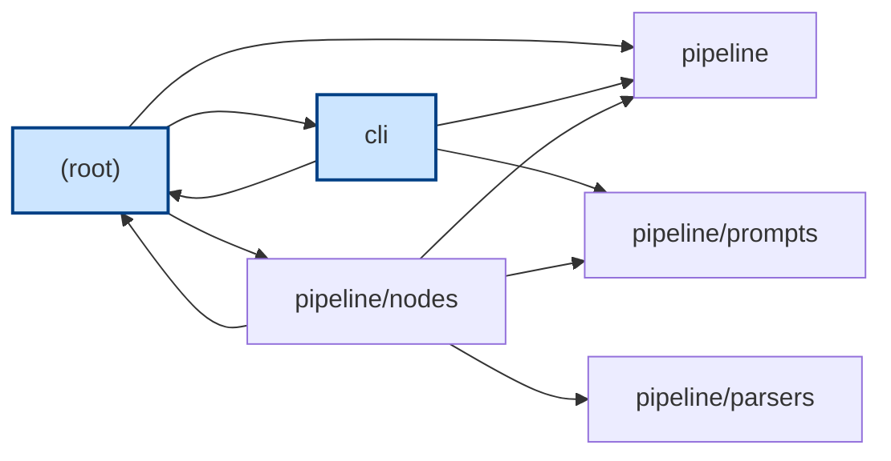
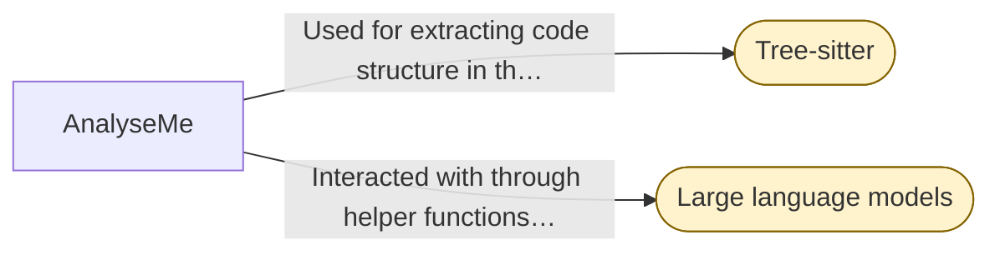

# Stage: Architecture Diagram

#### Module Dependencies

_Entry-point modules are highlighted. Edges are resolved imports between modules._

#### External Integrations

_External services the system integrates with (rounded nodes)._

#### Data Model

_Data entities from the extracted schemas; arrows show references between them._