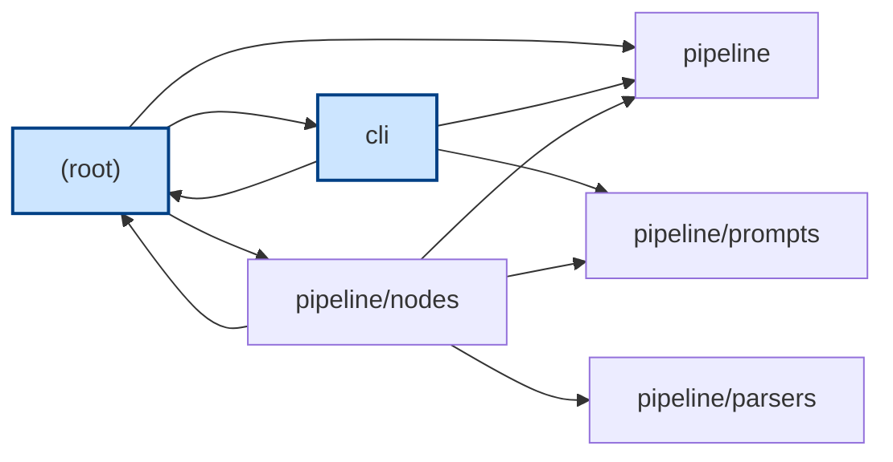
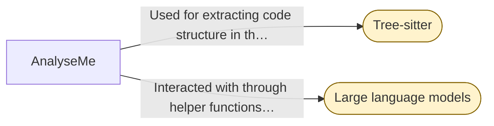
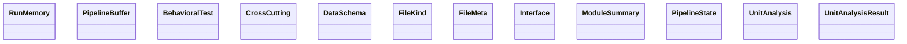

# Stage: Assembly (draft)

# Reimplementation Specification Document

## 1. Inventory

### File Tree Summary
- Total files: 364
- Languages detected: Bash, Python

### Languages
- Bash: 1 file
  - `run.sh`
- Python: 39 files
  - `cli.py`
  - `cli/__init__.py`
  - `cli/chat.py`
  - `cli/main.py`
  - `cli/utils.py`
  - `graph.py`
  - `main.py`
  - `pipeline/__init__.py`
  - `pipeline/artifacts.py`
  - `pipeline/cache.py`
  - `pipeline/indexer.py`
  - `pipeline/llm.py`
  - `pipeline/memory.py`
  - `pipeline/model_catalog.py`
  - `pipeline/nodes/__init__.py`
  - `pipeline/nodes/analyze_unit.py`
  - `pipeline/nodes/assemble_document.py`
  - `pipeline/nodes/extract_architecture.py`
  - `pipeline/nodes/generate_diagram.py`
  - `pipeline/nodes/generate_tests.py`
  - ... and 19 more

### Dependencies
- `requirements.txt` (Python):
  - `langgraph>=0.2`
  - `langchain-core>=0.3`
  - `langchain-ollama>=0.2`
  - `langchain-openai>=0.2`
  - `langsmith>=0.1`
  - `tree-sitter==0.21.3`
  - `tree-sitter-languages==1.10.2`
  - `pydantic>=2.0`
  - `click>=8.0`
  - `rich>=13.0`
  - ... and 6 more

### Entry Points
- `cli.py`
- `main.py`
- `cli/main.py`

## 2. Architecture

### Architecture Diagram

#### Module Dependencies

_Entry-point modules are highlighted. Edges are resolved imports between modules._

#### External Integrations

_External services the system integrates with (rounded nodes)._

#### Data Model

_Data entities from the extracted schemas; arrows show references between them._

### Components
- **Pipeline Module**: Manages the code-to-spec pipeline, including model configuration and output rendering.
- **Pipeline/Parsers Module**: Extracts code structure using Tree-sitter.
- **Pipeline/Nodes Module**: Handles tasks like document validation and test generation.
- **Pipeline/Prompts Module**: Defines prompt templates.
- **CLI Module**: Provides a command-line interface for repository interaction and pipeline management.
- **Root Module**: Offers a script for launching the application and defines data structures for code analysis.

### Data Flow
- Modules collaborate, particularly the `pipeline`, `pipeline/nodes`, and `cli` modules, to analyze code repositories and generate specifications.

### Module Boundaries
- Each module has specific responsibilities and interfaces, with the `pipeline` module acting as the central manager for the code-to-spec process.

## 3. Behavioral Spec

### Pipeline Module
- **Intent**: Manage the code-to-spec pipeline, including model configuration and output rendering.
- **Interfaces**: 
  - `RunMemory (class)`
  - `add (method)`
  - `retrieve (method)`
  - `select_context (function)`
  - `enabled (function)`
  - `cache_dir (function)`
  - `make_key (function)`
  - `get (function)`
  - `set (function)`
  - `clear (function)`
- **Side Effects**: Interacts with large language models and a vector store interface.
- **Errors**: Not detailed.

### Pipeline/Parsers Module
- **Intent**: Extract code structure using Tree-sitter.
- **Interfaces**: 
  - `extract_class_spans (function)`
  - `parse_file (function)`
- **Side Effects**: None specified.
- **Errors**: Not detailed.

### Pipeline/Nodes Module
- **Intent**: Handle tasks like document validation and test generation.
- **Interfaces**: 
  - `review_consistency (function)`
  - `route_units (function)`
  - `review_completeness (function)`
- **Side Effects**: Utilizes language models and handles data in structured formats like JSON.
- **Errors**: Not detailed.

### CLI Module
- **Intent**: Provide a command-line interface for repository interaction and pipeline management.
- **Interfaces**: 
  - `main (function)`
  - `chat_repl (function)`
- **Side Effects**: Manages the state of pipeline execution, including messages and node statuses.
- **Errors**: Not detailed.

## 4. Contracts

### Data Schemas
- **RunMemory**: Manages cross-run memory logs.
- **PipelineBuffer**: Manages the state of pipeline execution.
- **BehavioralTest**: Represents a behavioral test in the pipeline.
- **CrossCutting**: Represents cross-cutting concerns in the pipeline.
- **DataSchema**: Represents data schemas for analyzing and representing code units.
- **FileKind**: Represents the kind of a file in the pipeline.
- **FileMeta**: Represents metadata of a file in the pipeline.
- **Interface**: Represents an interface in the pipeline.
- **ModuleSummary**: Represents a summary of a module in the pipeline.
- **PipelineState**: Represents the state of the pipeline.
- **UnitAnalysis**: Represents the analysis of a code unit.
- **UnitAnalysisResult**: Represents the result of a unit analysis.

### API Surfaces
- Defined by the public interfaces of each module.

### Invariants
- Not detailed.

## 5. Cross-Cutting Concerns

### Error Handling
- Not detailed.

### Config
- Managed through the CLI and pipeline module.

### Logging
- Not detailed.

### Auth
- Not detailed.

### Concurrency
- Not detailed.

### External Integrations
- **Tree-sitter**: Used for extracting code structure in the `pipeline/parsers` module.
- **Large language models**: Interacted with through helper functions in the `pipeline` module.

## 6. Reimplementation Notes

- Ensure all interfaces and methods are implemented as specified.
- Avoid introducing unsupported claims or hallucinations.
- Maintain module boundaries and responsibilities as outlined.

## 7. Acceptance Tests

### Given/When/Then Tests

1. **cli/utils.py.ask_skip_tests**
   - **Given**: No preconditions
   - **When**: The `ask_skip_tests` function is called
   - **Then**: The function returns a boolean indicating whether to skip test files

2. **cli.py.main**
   - **Given**: All required inputs including repo, out, provider, ollama_url, max_parallelism, skip_tests, analysis_passes, and no_cache
   - **When**: `main` is called with these inputs
   - **Then**: The codebase is analyzed and a language-agnostic reimplementation spec is produced, with status and progress messages printed

3. **pipeline/nodes/generate_tests.generate_tests**
   - **Given**: A `PipelineState` object containing unit analyses
   - **When**: The `generate_tests` function is called with the `PipelineState`
   - **Then**: A dictionary is returned containing generated behavioral tests

4. **pipeline/nodes/validate.validate**
   - **Given**: A `PipelineState` object with unit analyses and a draft document
   - **When**: The `validate` function is called and the LLM call fails
   - **Then**: An Exception is raised

5. **pipeline/nodes/validate.validate**
   - **Given**: A `PipelineState` object with unit analyses and a draft document
   - **When**: The `validate` function is called with the `PipelineState`
   - **Then**: A dictionary is returned containing validation results, gaps, and the final document

6. **pipeline/reflection.reflect_on_run**
   - **Given**: A repository name, a list of programming languages, a unit count, and a list of hallucinations
   - **When**: The `reflect_on_run` function is called with these inputs
   - **Then**: A string is returned containing a concise reflection or an empty string on failure

7. **cli/utils.py._valid**
   - **Given**: A valid directory path as input
   - **When**: The `_valid` function is called with the directory path
   - **Then**: The function returns True

8. **cli/utils.py.ask_analysis_passes**
   - **Given**: No preconditions
   - **When**: The `ask_analysis_passes` function is called
   - **Then**: The function returns the number of analysis refinement passes

9. **pipeline/nodes/ingest.py.ingest**
   - **Given**: The repository is set up with files and dependency manifests
   - **When**: The `ingest` function is called
   - **Then**: The function walks the repository, classifies files, parses dependency manifests, and detects entry points

10. **pipeline/nodes/review_completeness.review_completeness**
    - **Given**: A `PipelineState` object including unit analyses and repo path
    - **When**: The `review_completeness` function is called with the `PipelineState`
    - **Then**: A dictionary is returned containing analysis questions, completeness status, and pass number

11. **pipeline/parsers/tree_sitter_parser._structure**
    - **Given**: Lists of functions, classes, imports, and a LOC count are provided
    - **When**: The `_structure` function is called with the lists and LOC count
    - **Then**: A structured representation of the code is returned as a dictionary

12. **pipeline/artifacts.render_class_spec**
    - **Given**: A `UnitAnalysis` object is provided
    - **When**: The `render_class_spec` function is called with the `UnitAnalysis`
    - **Then**: A Markdown representation of the unit analysis is returned as a string