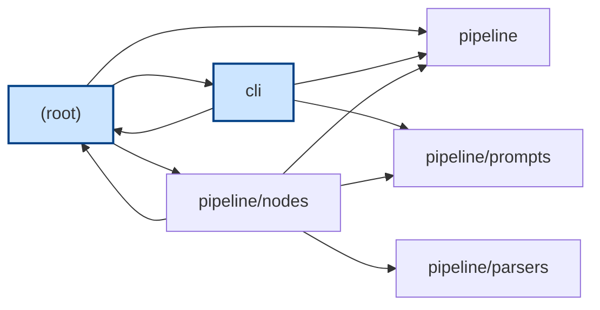
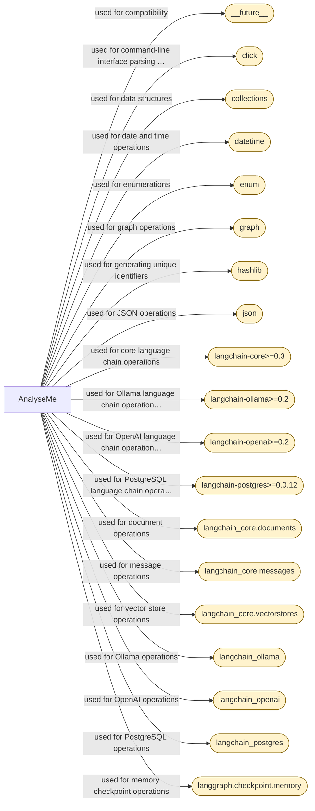
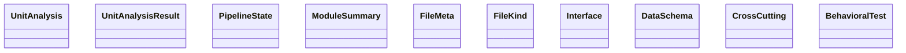

# Stage: Assembly (draft)

# Reimplementation Specification Document

## 1. Inventory

### File Tree Summary
- **Languages Detected**: Bash, Python
- **Total Files**: 50 (10 non-source)

### Bash Files
- `run.sh`

### Python Files
- `cli.py`
- `cli/__init__.py`
- `cli/chat.py`
- `cli/main.py`
- `cli/utils.py`
- `graph.py`
- `main.py`
- `pipeline/__init__.py`
- `pipeline/artifacts.py`
- `pipeline/cache.py`
- `pipeline/indexer.py`
- `pipeline/llm.py`
- `pipeline/memory.py`
- `pipeline/model_catalog.py`
- `pipeline/nodes/__init__.py`
- `pipeline/nodes/analyze_unit.py`
- `pipeline/nodes/assemble_document.py`
- `pipeline/nodes/extract_architecture.py`
- `pipeline/nodes/generate_diagram.py`
- `pipeline/nodes/generate_tests.py`
- ... and 19 more

### Entry Points
- `cli.py`
- `main.py`
- `cli/main.py`

### Dependency Manifests
- **Python**: `requirements.txt`
  - `langgraph>=0.2`
  - `langchain-core>=0.3`
  - `langchain-ollama>=0.2`
  - `langchain-openai>=0.2`
  - `langsmith>=0.1`
  - `tree-sitter==0.21.3`
  - `tree-sitter-languages==1.10.2`
  - `pydantic>=2.0`
  - `click>=8.0`
  - `rich>=13.0`
  - ... and 6 more

### Module Dependencies
- **Internal**: `cli`, `pipeline`, `pipeline/nodes`
- **External**: `click`, `langchain-core`, `langchain-ollama`, `langchain-openai`, `pydantic`, `rich`, etc.

## 2. Architecture

### Architecture Diagram

#### Module Dependencies

_Entry-point modules are highlighted. Edges are resolved imports between modules._

#### External Integrations

_External services the system integrates with (rounded nodes)._

#### Data Model

_Data entities from the extracted schemas; arrows show references between them._

### Components
- **CLI**: Manages user interaction and pipeline configuration.
- **Pipeline**: Core module for executing analysis tasks.
- **Parsers**: Extracts code structure using Tree-sitter.
- **Nodes**: Performs specific tasks like validation and test generation.
- **Prompts**: Defines prompt templates for LLM interactions.

### Data Flow
- Execution begins at entry points, initializing the CLI or main application.
- The CLI interacts with the pipeline to configure and execute analysis tasks.
- The pipeline coordinates with nodes and parsers to perform analysis and generate documentation.

### Module Boundaries
- **CLI**: Interfaces with users and manages pipeline execution.
- **Pipeline**: Manages analysis tasks and interactions with LLMs.
- **Parsers**: Operates independently to extract code structure.
- **Nodes**: Collaborates with the pipeline for specific analysis tasks.

## 3. Behavioral Spec

### CLI Module
- **Intent**: Provides an interactive interface for managing analysis pipelines.
- **Interfaces**: Includes functions like `ask_model`, `ask_ollama_model`, `ask_max_files`, `ask_skip_tests`, `ask_analysis_passes`.
- **Side Effects**: User prompts and terminal UI updates.
- **Errors**: Handles user input errors.

### Pipeline Module
- **Intent**: Facilitates code-to-spec analysis and manages LLM interactions.
- **Interfaces**: Methods like `add`, `retrieve`, `store_run`, `get_past_context`.
- **Side Effects**: Caching, indexing, and logging.
- **Errors**: Raises exceptions for LLM call failures and repository resolution issues.

### Parsers Module
- **Intent**: Extracts code structure using Tree-sitter.
- **Interfaces**: Functions like `extract_class_spans`, `parse_file`.
- **Side Effects**: None specified.
- **Errors**: None specified.

### Nodes Module
- **Intent**: Performs specific tasks like validation and test generation.
- **Interfaces**: Functions like `validate`, `generate_tests`, `extract_architecture`.
- **Side Effects**: None specified.
- **Errors**: Raises exceptions for validation failures.

## 4. Contracts

### Data Schemas
- **UnitAnalysis**: Represents the analysis of a code unit.
- **UnitAnalysisResult**: Holds results of a unit analysis.
- **PipelineState**: Represents the state of pipeline execution.
- **ModuleSummary**: Summarizes a module's characteristics.
- **FileMeta**: Metadata for a file in the repository.
- **FileKind**: Represents the kind of file in the repository.
- **Interface**: Represents an interface in the codebase.
- **DataSchema**: Represents a data schema in the codebase.
- **CrossCutting**: Represents cross-cutting concerns.
- **BehavioralTest**: Represents a behavioral test.

### API Surfaces
- Defined by public interfaces in each module.

### Invariants
- Consistent data representation across modules.

## 5. Cross-Cutting Concerns

### Error Handling
- Uses exceptions like `Exception`, `ValueError`, `RuntimeError`, `OSError`, and `SystemExit`.

### Configuration
- Managed using environment variables across multiple modules.

### Logging
- Evidenced in `pipeline/indexer.py::index_run`.

### Authentication
- Not specified.

### Concurrency
- Managed using `threading.BoundedSemaphore`.

### External Integrations
- Includes `click`, `langchain-core`, `langchain-ollama`, `langchain-openai`, `pydantic`, `rich`, etc.

## 6. Reimplementation Notes

- Ensure adherence to specified interfaces and data schemas.
- Avoid introducing unsupported claims or hallucinations.
- Maintain consistency with the current analysis.

## 7. Acceptance Tests

### Given/When/Then Tests

1. **BehavioralTest**
   - **Given**: Define language-neutral acceptance criteria.
   - **When**: Called with valid inputs.
   - **Then**: Produces the documented result.

2. **cli/utils.py.ask_skip_tests**
   - **Given**: User prompted to skip test files.
   - **When**: User decides to skip or not.
   - **Then**: Returns a boolean indicating the decision.

3. **pipeline/nodes/generate_tests.generate_tests**
   - **Given**: A `PipelineState` with unit analyses.
   - **When**: Called with the `PipelineState`.
   - **Then**: Returns a dictionary with generated tests.

4. **pipeline/nodes/validate.validate**
   - **Given**: A `PipelineState` with unit analyses and a draft document.
   - **When**: Called and LLM call fails.
   - **Then**: Raises an `Exception`.

5. **pipeline/nodes/validate.validate**
   - **Given**: A `PipelineState` with unit analyses and a draft document.
   - **When**: Called with the `PipelineState`.
   - **Then**: Returns validation results, gaps, and the final document.

6. **state_schema.py::UnitAnalysis**
   - **Given**: Represents the output of a map step.
   - **When**: Called with valid inputs.
   - **Then**: Produces the documented result.

7. **state_schema.py::UnitAnalysisResult**
   - **Given**: Captures intent fields of an analysis unit.
   - **When**: Called with valid inputs.
   - **Then**: Produces the documented result.

8. **cli/main.py.interactive_viewer**
   - **Given**: Pipeline execution complete and documents available.
   - **When**: Called with the final document.
   - **Then**: User can browse the document in the terminal UI.

9. **pipeline/reflection.reflect_on_run**
   - **Given**: Repository name, languages, unit count, hallucinations.
   - **When**: Called with these inputs.
   - **Then**: Returns a reflection on the analysis.

10. **pipeline/nodes/extract_architecture.py._aggregate_evidence**
    - **Given**: Unit analyses and a dependency manifest.
    - **When**: Called with these inputs.
    - **Then**: Returns aggregated evidence of cross-cutting concerns.

11. **cli/main.py._render_doc**
    - **Given**: Terminal UI ready to display content.
    - **When**: Called with a title and content.
    - **Then**: Renders the document in the terminal UI.

12. **pipeline/parsers/tree_sitter_parser.py._structure**
    - **Given**: Lists of function names, class names, import statements, and loc count.
    - **When**: Called with these inputs.
    - **Then**: Builds and returns a structured representation of the code.

## Interface Index

_Complete list of public interfaces extracted from the source (ground truth)._

### `cli.py`
- **main** (function) — `main(repo: str, out: str, provider: str, model: str | None, ollama_url: str, max_parallelism: int, max_files: int | None, skip_tests: bool, analysis_passes: int, thread_id: str | None, langsmith_project: str | None, no_cache: bool, clear_cache: bool)`

### `cli/chat.py`
- **_format_context** (function) — `_format_context(docs) -> str`
- **_sources_line** (function) — `_sources_line(docs) -> str`
- **chat_repl** (function) — `chat_repl(collection: str, k: int = 8) -> None`

### `cli/main.py`
- **PipelineBuffer** (class) — `PipelineBuffer(max_messages: int = 100)`
- **__init__** (method) — `__init__(self, max_messages: int = 100)`
- **add_message** (method) — `add_message(self, msg_type: str, content: str) -> None`
- **set_node** (method) — `set_node(self, node_id: str, status: str) -> None`
- **complete_node** (method) — `complete_node(self, node_id: str) -> None`

### `cli/main.py`
- **_default** (function) — `_default(ctx: typer.Context) -> None`
- **create_layout** (function) — `create_layout() -> Layout`
- **update_display** (function) — `update_display(layout: Layout) -> None`
- **get_user_selections** (function) — `get_user_selections() -> dict`
- **step_box** (function) — `step_box(title: str, hint: str) -> None`
- **_safe_name** (function) — `_safe_name(path: str) -> str`
- **_persist_class_spec** (function) — `_persist_class_spec(ua) -> None`
- **_persist_stage_doc** (function) — `_persist_stage_doc(node_id: str, update: dict) -> None`
- **_pause** (function) — `_pause(message: str = 'Press Enter to return to the menu…') -> None`
- **_render_doc** (function) — `_render_doc(title: str, content: str) -> None`
- **interactive_viewer** (function) — `interactive_viewer(final_doc: str) -> None`
- **run_pipeline** (function) — `run_pipeline(no_cache: bool = False, clear_cache: bool = False) -> None`

### `cli/utils.py`
- **ask_repo_path** (function) — `ask_repo_path() -> str`
- **_valid** (function) — `_valid(val: str) -> bool | str`
- **ask_output_file** (function) — `ask_output_file() -> str`
- **ask_provider** (function) — `ask_provider() -> str`
- **ask_model** (function) — `ask_model(provider: str) -> str`
- **ask_ollama_model** (function) — `ask_ollama_model() -> str`
- **ask_max_files** (function) — `ask_max_files() -> int | None`
- **ask_skip_tests** (function) — `ask_skip_tests() -> bool`
- **ask_analysis_passes** (function) — `ask_analysis_passes() -> int`

### `graph.py`
- **route_to_units** (function) — `route_to_units(state: PipelineState) -> list[Send]`
- **should_refine_analysis** (function) — `should_refine_analysis(state: PipelineState)`
- **should_revise** (function) — `should_revise(state: PipelineState) -> str`
- **build_graph** (function) — `build_graph(checkpointer=None)`

### `pipeline/artifacts.py`
- **render_class_spec** (function) — `render_class_spec(ua) -> str`
- **render_stage_doc** (function) — `render_stage_doc(node_id: str, update: dict) -> str | None`
- **write_text** (function) — `write_text(path: Path, content: str) -> None`

### `pipeline/cache.py`
- **enabled** (function) — `enabled() -> bool`
- **cache_dir** (function) — `cache_dir() -> Path`
- **make_key** (function) — `make_key(*parts: str) -> str`
- **get** (function) — `get(key: str)`
- **set** (function) — `set(key: str, value) -> None`
- **clear** (function) — `clear() -> int`

### `pipeline/indexer.py`
- **_chunk** (function) — `_chunk(text: str, size: int = 1400, overlap: int = 150) -> list[str]`
- **_split_spec_sections** (function) — `_split_spec_sections(spec: str) -> list[tuple[str, str]]`
- **index_run** (function) — `index_run(repo_path: str, class_docs: dict[str, str], spec_text: str, log=print) -> tuple[str, int]`

### `pipeline/llm.py`
- **get_provider** (function) — `get_provider() -> str`
- **get_model_id** (function) — `get_model_id() -> str`
- **get_llm** (function) — `get_llm(temperature: float = 0)`
- **_invoke_with_retry** (function) — `_invoke_with_retry(llm, messages, max_conn_retries: int = 5)`
- **_extract_json_from_text** (function) — `_extract_json_from_text(text: str) -> str`
- **_try_repair_json** (function) — `_try_repair_json(text: str) -> str`
- **call_llm_json** (function) — `call_llm_json(prompt: str, max_retries: int = 2) -> dict | list`
- **_call_llm_json_uncached** (function) — `_call_llm_json_uncached(prompt: str, max_retries: int = 2) -> dict | list`
- **call_llm_structured** (function) — `call_llm_structured(prompt: str, schema, max_retries: int = 2)`
- **_call_llm_structured_uncached** (function) — `_call_llm_structured_uncached(prompt: str, schema, max_retries: int = 2)`
- **call_llm_text** (function) — `call_llm_text(prompt: str) -> str`

### `pipeline/memory.py`
- **__init__** (method) — `__init__(self, path: str | os.PathLike | None = None, max_entries: int | None = 50)`
- **store_run** (method) — `store_run(self, repo_path: str, model: str, languages: list[str], unit_count: int, hallucinations: list[str], reflection: str = "") -> None`
- **_load_blocks** (method) — `_load_blocks(self) -> list[str]`
- **get_past_context** (method) — `get_past_context(self, repo_path: str, n: int = 3) -> str`
- **_rotate** (method) — `_rotate(self, blocks: list[str]) -> list[str]`

### `pipeline/model_catalog.py`
- **list_providers** (function) — `list_providers() -> list[tuple[str, str]]`
- **provider_config** (function) — `provider_config(provider: str) -> dict`
- **get_model_options** (function) — `get_model_options(provider: str) -> list[tuple[str, str]]`
- **default_model** (function) — `default_model(provider: str) -> str`

### `pipeline/nodes/analyze_unit.py`
- **_get_semaphore** (function) — `_get_semaphore(size: int) -> threading.BoundedSemaphore`
- **_elide** (function) — `_elide(source_bytes: bytes, ranges: list) -> str`
- **_select_source** (function) — `_select_source(state: dict) -> tuple[str, str]`
- **analyze_unit** (function) — `analyze_unit(state: dict) -> dict`

### `pipeline/nodes/assemble_document.py`
- **_build_inventory** (function) — `_build_inventory(state: PipelineState) -> str`
- **_build_interface_index** (function) — `_build_interface_index(state: PipelineState) -> str`
- **_insert_diagram** (function) — `_insert_diagram(doc: str, diagram: str) -> str`
- **assemble_document** (function) — `assemble_document(state: PipelineState) -> dict`

### `pipeline/nodes/extract_architecture.py`
- **_aggregate_evidence** (function) — `_aggregate_evidence(unit_analyses, dep_manifest) -> dict`
- **extract_architecture** (function) — `extract_architecture(state: PipelineState) -> dict`
- **_summary** (function) — `_summary(items: list[str], n: int = 5) -> str`

### `pipeline/nodes/generate_diagram.py`
- **_node_id** (function) — `_node_id(name: str) -> str`
- **_module_label** (function) — `_module_label(name: str) -> str`
- **_clean_label** (function) — `_clean_label(text: str, limit: int = 40) -> str`
- **_module_graph** (function) — `_module_graph(modules, entry_points) -> str | None`
- **_integrations_graph** (function) — `_integrations_graph(cross_cutting, system_label: str) -> str | None`
- **_member_name** (function) — `_member_name(name: str) -> str`
- **_field_type** (function) — `_field_type(prop) -> str`
- **_refs** (function) — `_refs(prop) -> set[str]`
- **_data_model** (function) — `_data_model(data_schemas) -> str | None`
- **generate_diagram** (function) — `generate_diagram(state: PipelineState) -> dict`

### `pipeline/nodes/generate_tests.py`
- **generate_tests** (function) — `generate_tests(state: PipelineState) -> dict`

### `pipeline/nodes/ingest.py`
- **_resolve_dependencies** (function) — `_resolve_dependencies(files: list[FileMeta]) -> None`
- **_exists** (function) — `_exists(base: str, exts: tuple[str, ...]) -> str | None`
- **_resolve_one** (function) — `_resolve_one(imp: str, language: str, file_dir: str) -> str | None`
- **_classify_kind** (function) — `_classify_kind(rel_path: str, ext: str) -> FileKind`
- **_extract_imports** (function) — `_extract_imports(source: str, language: str) -> list[str]`
- **_parse_requirements_txt** (function) — `_parse_requirements_txt(path: str) -> dict`
- **_parse_package_json** (function) — `_parse_package_json(path: str) -> dict`
- **_parse_go_mod** (function) — `_parse_go_mod(path: str) -> dict`
- **_parse_cargo_toml** (function) — `_parse_cargo_toml(path: str) -> dict`
- **_parse_pom_xml** (function) — `_parse_pom_xml(path: str) -> dict`
- **ingest** (function) — `ingest() -> None`

### `pipeline/nodes/reduce_modules.py`
- **reduce_modules** (function) — `reduce_modules(state: PipelineState) -> dict`

### `pipeline/nodes/review_completeness.py`
- **review_completeness** (function) — `review_completeness(state: PipelineState) -> dict`

### `pipeline/nodes/review_consistency.py`
- **_build_ground_truth** (function) — `_build_ground_truth(state: PipelineState) -> str`
- **_dep_name** (function) — `_dep_name(s: str) -> str`
- **_norm** (function) — `_norm(t: str) -> str`
- **_is_symbol_like** (function) — `_is_symbol_like(t: str) -> bool`
- **_collect_known_symbols** (function) — `_collect_known_symbols(state: PipelineState) -> set[str]`
- **_filter_findings** (function) — `_filter_findings(findings: list[str], state: PipelineState) -> list[str]`
- **_strip_deterministic** (function) — `_strip_deterministic(doc: str) -> str`
- **review_consistency** (function) — `review_consistency(state: PipelineState) -> dict`

### `pipeline/nodes/route_units.py`
- **_file_units** (function) — `_file_units(file_meta, repo_path: str, max_parallelism: int) -> list[dict]`
- **route_units** (function) — `route_units(state: PipelineState) -> dict`

### `pipeline/nodes/synthesize_system.py`
- **synthesize_system** (function) — `synthesize_system(state: PipelineState) -> dict`

### `pipeline/nodes/validate.py`
- **validate** (function) — `validate(state: PipelineState) -> dict`

### `pipeline/parsers/tree_sitter_parser.py`
- **_get_lang_from_path** (function) — `_get_lang_from_path(path: str) -> str | None`
- **_get_ts_parser** (function) — `_get_ts_parser(language: str)`
- **_extract_go_imports** (function) — `_extract_go_imports(source: str) -> list[str]`
- **_extract_imports_regex** (function) — `_extract_imports_regex(source: str, language: str) -> list[str]`
- **_count_loc** (function) — `_count_loc(source: str) -> int`
- **_structure** (function) — `_structure(functions: list, classes: list, imports: list, loc: int) -> dict`
- **_empty_structure** (function) — `_empty_structure(source: str) -> dict`
- **_first_name** (function) — `_first_name(node, source_bytes: bytes) -> str | None`
- **_traverse_for_names** (function) — `_traverse_for_names(node, source_bytes: bytes, functions: list, classes: list)`
- **_collect_class_spans** (function) — `_collect_class_spans(node, source_bytes: bytes, out: list, inside_class: bool = False) -> None`
- **extract_class_spans** (function) — `extract_class_spans(path: str) -> list[dict]`
- **parse_file** (function) — `parse_file(path: str)`

### `pipeline/rag.py`
- **__init__** (method) — `__init__(self)`
- **add** (method) — `add(self, items: list[tuple[str, str]]) -> None`
- **retrieve** (method) — `retrieve(self, query: str, k: int)`
- **select_context** (function) — `select_context(full_text: str, records: list[dict], query: str, char_budget: int = RAG_CHAR_BUDGET, k: int = 12) -> tuple[str, bool]`

### `pipeline/reflection.py`
- **reflect_on_run** (function) — `reflect_on_run(repo_name: str, languages: list[str], unit_count: int, hallucinations: list[str]) -> str`

### `pipeline/repo_source.py`
- **is_git_url** (function) — `is_git_url(source: str) -> bool`
- **_clone_dir_name** (function) — `_clone_dir_name(url: str) -> str`
- **_normalize_url** (function) — `_normalize_url(url: str) -> str`
- **resolve_repo_source** (function) — `resolve_repo_source(source: str, log=print, force_fresh: bool = False) -> str`

### `pipeline/vectordb.py`
- **get_conn_string** (function) — `get_conn_string() -> str`
- **get_embeddings** (function) — `get_embeddings()`
- **collection_for** (function) — `collection_for(repo_path: str) -> str`
- **get_store** (function) — `get_store(collection: str, embed_meta: dict | None = None)`
- **_provider_from_dim** (function) — `_provider_from_dim(dim: int) -> dict | None`
- **collection_embed_config** (function) — `collection_embed_config(collection: str) -> dict | None`
- **_raw_conn_string** (function) — `_raw_conn_string() -> str`
- **check_connection** (function) — `check_connection() -> tuple[bool, str]`
- **list_collections** (function) — `list_collections() -> list[str]`

### `state_schema.py`
- **merge_unit_analyses** (function) — `merge_unit_analyses(existing, new)`
- **FileKind** (class) — `class FileKind(str, Enum)`
- **FileMeta** (class) — `class FileMeta(BaseModel)`
- **Interface** (class) — `class Interface(BaseModel)`
- **UnitAnalysis** (class) — `class UnitAnalysis(BaseModel)`
- **UnitAnalysisResult** (class) — `class UnitAnalysisResult(BaseModel)`
- **ModuleSummary** (class) — `class ModuleSummary(BaseModel)`
- **DataSchema** (class) — `class DataSchema(BaseModel)`
- **CrossCutting** (class) — `class CrossCutting(BaseModel)`
- **BehavioralTest** (class) — `class BehavioralTest(BaseModel)`
- **PipelineState** (class) — `class PipelineState(TypedDict, total=False)`
